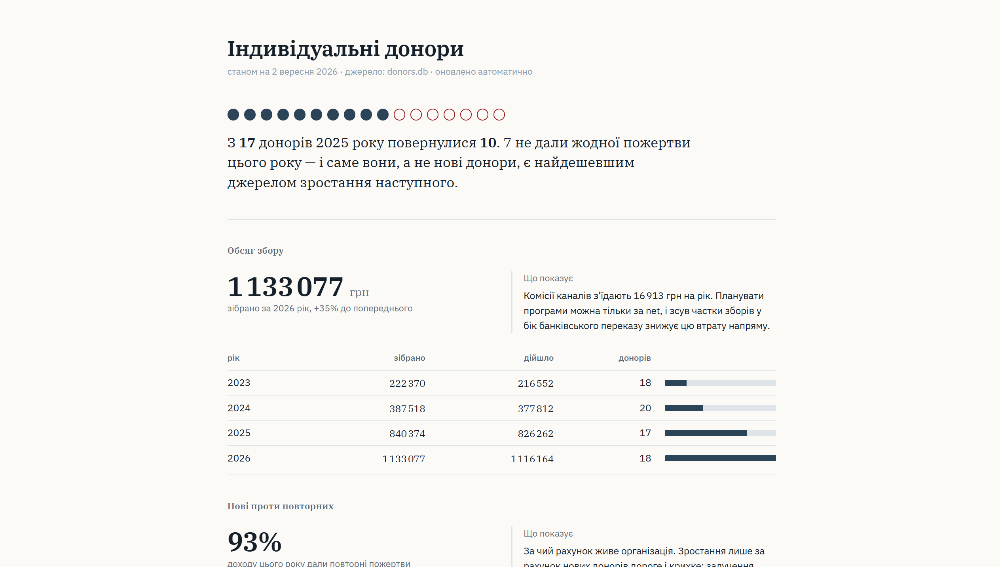

# Donor Data Platform — прототип

Прототип автоматизації роботи з донорською базою: обробка пожертв із
чотирьох каналів, ідентифікація донора, оновлення метрик, сегментація,
автоматичні комунікації та fundraising-аналітика.



## Запуск

Потрібен тільки Python 3.10 або новіший. Зовнішніх залежностей немає —
жодного `pip install`.

```bash
cd donor-platform
python3 run.py
```

Скрипт виконує весь цикл і друкує звіт у консоль. База створюється
в `data/donors.db`, попередня перезаписується.

Перевірити версію Python:

```bash
python3 --version
```

## Що робить `run.py`

| Крок | Дія |
|---|---|
| 1 | Генерує тестові дані для чотирьох каналів із навмисними дефектами |
| 2 | Завантажує й обробляє: ідемпотентність, валідація, матчинг донорів |
| 3 | Звіряє суми в базі з контрольними сумами джерел |
| 4 | Перераховує метрики донорів, рахує RFM, присвоює сегменти |
| 5 | Ставить у чергу автоматичні комунікації та задачі менеджерам |
| 6 | Показує чергу ручного розгляду, демонструє злиття донорів і відкат |
| 7 | Вимірює якість матчингу проти ground truth |
| 8 | Друкує fundraising-показники |
| 9 | Генерує HTML-дашборд у `docs/dashboard.html` |

## Структура

```
donor-platform/
├── run.py                    оркестратор, запускає весь цикл
├── sql/
│   └── schema.sql            схема даних: 19 таблиць, 2 view
├── src/
│   ├── normalize.py          транслітерація, нормалізація, Jaro-Winkler
│   ├── generate_data.py      генератор тестових даних із 20 пастками
│   ├── db.py                 підключення, довідники, курси валют
│   ├── matching.py           ідентифікація донора, 4 рівні
│   ├── ingest.py             парсери каналів і пайплайн обробки
│   ├── merge.py              злиття донорів, відкат, закриття черги
│   ├── metrics.py            метрики донора, RFM, сегментація
│   ├── actions.py            автоматичні дії після пожертви
│   ├── reconcile.py          звірка з джерелами
│   ├── analytics.py          сім ключових показників
│   ├── evaluate.py           оцінка якості матчингу
│   └── dashboard.py          генератор reporting view
├── docs/
│   ├── solution.md           опис рішення
│   ├── dashboard.html        згенерований дашборд (відкрити в браузері)
│   └── dashboard.png         скріншот дашборду
└── data/
    ├── incoming/             вхідні файли каналів (генеруються)
    ├── ground_truth.csv      істина для оцінки матчингу
    ├── traps.json            перелік закладених дефектів
    └── donors.db             SQLite, створюється при запуску
```

## Окремі частини

```bash
cd src
python3 generate_data.py      # тільки перегенерувати вхідні дані
python3 evaluate.py           # тільки оцінка якості матчингу
```

Подивитись базу:

```bash
sqlite3 data/donors.db
sqlite> .tables
sqlite> SELECT segment, COUNT(*) FROM donor_metrics GROUP BY segment;
sqlite> SELECT * FROM match_review_queue WHERE status='open' LIMIT 5;
```

## Результати останнього прогону

```
Завантажено пожертв        131
Профілів створено           31   (на 24 реальні особи)

Precision                1.0000   жоден профіль не змішує різних людей
Recall                   0.8911   пропущені збіги пішли в чергу на розгляд
F1                       0.9424

Звірка з джерелами           4/4 каналів, залишок 0.00
Перевірка пасток             8/8
```

Recall навмисно нижчий за precision. Ціна помилок асиметрична: хибне
злиття перемішує історію пожертв і виправляється тижнями, пропущене
злиття видно в черзі й закривається одним рухом. У сумнівних випадках
алгоритм не вгадує.

## Тестові дані

Дані генеруються з фіксованим seed, тому результати відтворювані.
У них навмисно закладено 20 дефектів, які трапляються в реальній
роботі: той самий донор у чотирьох каналах кирилицею й латиницею,
Gmail із крапками й `+тегом`, повторний імпорт файлу, ретрай вебхука,
двоє різних людей зі схожими прізвищами, тезки, пожертви без email,
три валюти, комісії, повернення, невдалий платіж підписки, різні
формати сум і дат, нерозбірлива дата, анонім, донор-організація,
зміна прізвища, некоректна сума, донор без згоди на розсилку,
великий донат і донор, який повернувся після довгої паузи.

Повний перелік — у `data/traps.json`.
